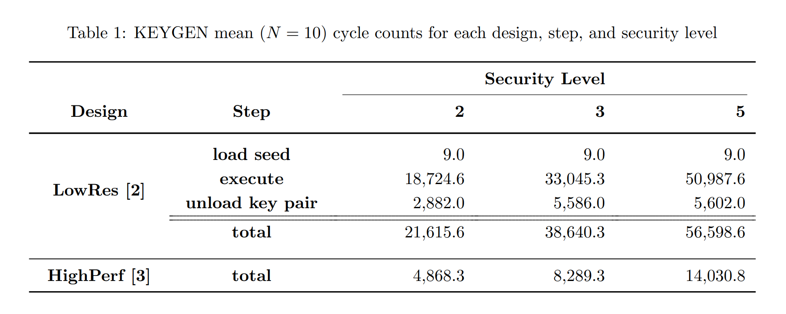
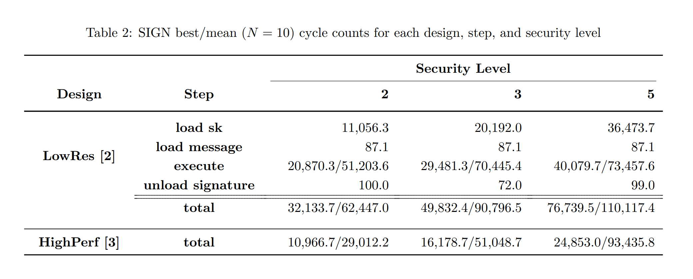
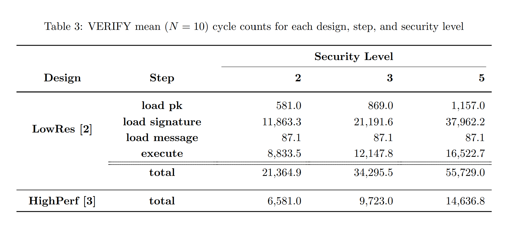
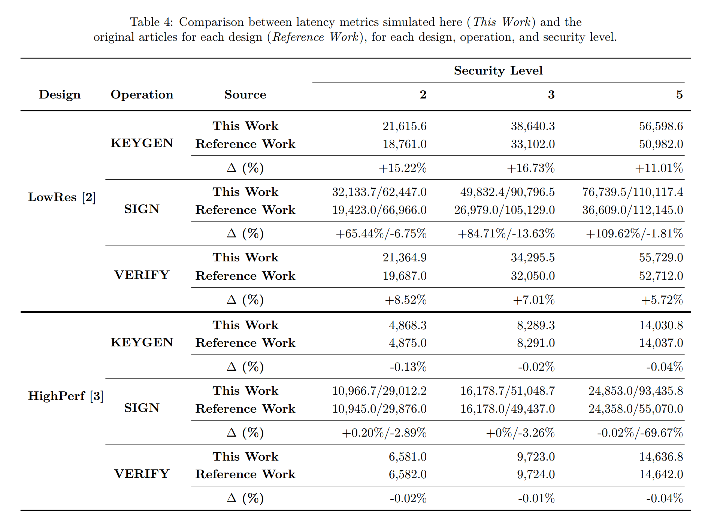
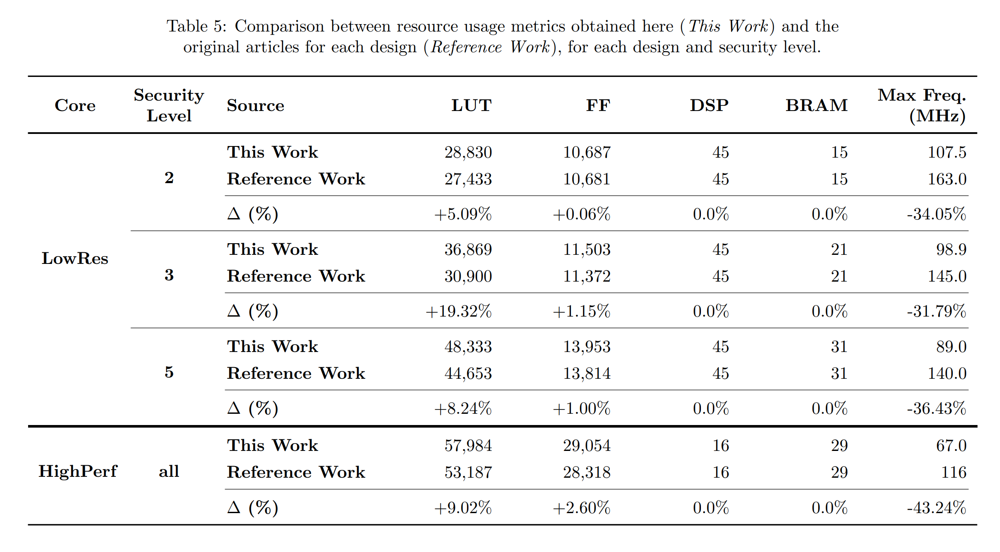

# Overview

This project briefly compares two  RTL designs that fully implement the CRYSTALS-Dilithium [1] algorithm. Some important aspects of each design are highlighted, and quantitative performance measurements are provided.

## ⚠️ A note on correctness

**Originally, both designs had bugs which either produced incorrect output values, or limited their usability in real-world scenarios.**

Notably, in the case of the design in [2], a small but critical bug related to the NTT module was discovered and detailed in the work presented in [5]. Although relatively easy to fix, the time-constrained nature of this project means that **this bug has (so far) been left unchanged**, since it is not expected to impact either latency or resource usage significantly. It does, however, affect the correctness of both signature generation and verification.

Moreover, another bug was found in the design in [2], concerning an out-of-bounds memory access when simulating signature verifications, specifically using the security level 3 parameters. The memory accesses were changed so as to allow the simulation to complete. However, it is possible that this quick fix has not corrected the underlying bug.

The remaining bugs found, in both the designs, were mostly concerning data transfer operations. These were duly fixed, as briefly mentioned in Sections 2.2 and 2.3.

# 1. Introduction

Although a plethora of work exists detailing different hardware-accelerated implementations of Dilithium, the source code for them are tipically not found online. The only exceptions found are the two projects presented here: *A Hard Crystal - Implementing Dilithium on Reconfigurable Hardware* [2], and *High-Performance Hardware Implementation of CRYSTALS-Dilithium* [3]. These works follow somewhat different strategies in implementing Dilithium, making it interesting to compare them, not only in terms of latency and resource usage, but also from a qualitative perspective.

> ℹ️ **Note**
> 
> There is also a third hardware-accelerated implementation of Dilithium in *Optimized Hardware-Software Co-Design for Kyber and Dilithium on RISC-V SoC FPGA* [4].
> 
> However, this alternative follows a hybrid hardware-software approach, in which only some operations are accelerated in hardware, and the others are performed by four ARM hard cores.
>
> Therefore, this third implementation not only differs significantly from the others, but it also is not as easily simulated using the typical Vivado workflow.

For reasons that will become apparent later, we have decided to call the implementation in [2] "LowRes" (*Low Resource Usage*), and the implementation in [3] "HighPerf" (*High Performance*), in order to differentiate them. We also refer to the three main Dilithium operations as `KEYGEN`, `SIGN`, and `VERIFY`.

# 2. Key design points

## 2.1. Modularity

The two cores are designed with different degrees of modularity.

Specifically, LowRes is composed of three base designs — each capable of performing one of Dilithium's three main operations — and one additional design that essentially integrates the other three to provide a complete suite for the algorithm.

This modular structure allows for projects which only need to perform one of the operations (for example, a system that is only interested in validating signatures), to reduce its resource usage.

Each design itself also comes in three variants, one for each security level specified for Dilithium. This means that, although the difference between these variants is essentially that of internal buffer sizes, there is currently no option to select the security level at runtime.

HighPerf, on the other hand, is a single unified design capable of performing all three Dilithium operations. Moreover, the security level for a given operation can be decided at runtime by use of the `sec_level` input signal.

## 2.2. Interfaces

Considering the data throughput necessary for the operations in Dilithium, both cores are designed with a streaming interface similar to that of AXI-Stream [6], coupled with a side-band for certain control signals, such as `start`, or `sec_level` (in the case of HighPerf).

One of the main differences between the two designs is that HighPerf has a 64-bit datapath, while LowRes uses a 32-bit one. This alone effectively doubles the latency of load and store operations in LowRes, when compared to HighPerf.

Furthermore, **both designs originally had bugs related to the handshaking protocol used for this interface**. In the case of LowRes, this issue was resolved simply by changing some internal signal definitions.

For HighPerf, the most straightforward solution was to introduce a buffer that captures the core's output and retransmits it to the streaming interface, correctly following the protocol. This, in turn, increases the amount of resources required by the design. Although there are certainly more efficient solutions which require changing the core's FSMs, it should be noted that this additional buffer represents less than 3% of the total memory needed by the original design.

## 2.3. Pipelining and data reusability

The two cores have different ways of mitigating the latency for the Dilithium operations. Notably, HighPerf has a highly pipelined design that allows for simultaneously executing independent steps (reading the original paper is recommended for more details).

**HighPerf's pipeline originally had a bug**, in which it did not account for backpressure when loading some of the necessary data; it assumed the input would be completely available under a certain amount of time after initiating the operation. It did not stall the pipeline if that was not the case, thus producing incorrect output values. This, of course, would reduce the usefulness of the core in real life scenarios, such as when loading a long message in chunks. The necessary stalls (or at least, the ones identified) were introduced in HighPerf's code provided here.

LowRes's design implements significantly less pipelining. On the other hand, while HighPerf's design is based on streaming all the data necessary for each Dilithium operation, LowRes allows for performing intermediate loading and storing operations separately from the main processing steps. This then allows for reusing data across different operations, which reduces data transfer times.

For example, suppose we wanted to compute several signatures using the same secret key, HighPerf requires loading the key for every signature, while LowRes would only load the key when performing the first signature, and reuse that value for the subsequent ones.

## 2.4. Keccak

Dilithium's operations internally use a collision resistant hash function, both for hashing and also for pseudo-random number generation. The CRHF used is specified to be SHAKE256 for hashing, and SHAKE128 for PRNG (specifically, when expanding the matrix `A`).

As such, both designs include an implementation of a core that performs the Keccak family of functions [7]. This is somewhat important since the SHAKE operations are typically one of the bottlenecks for the Dilithium algorithm as a whole.

Both designs execute a Keccak round in one cycle, and therefore finish the Keccak-f[1600] permutation in 24 cycles. Similarly, in both cases the Keccak state is implemented as a single 1600 bit register, with different values for `(c, r)` depending on which SHAKE operation is being performed.

LowRes's Keccak core has a very simple design, in which the state buffer is directly accessed after each permutation, both to load the next input block, and similarly to dump the next output block.

HighPerf reduces the latency for these load and dump operations by pipelining the Keccak core design into three stages, as well as introducing one input buffer and one output buffer. As a result, the Keccak permutation can be executed while the next input block is being loaded in parallel, and the previous output block is being dumped.

Moreover, to maximize throughput even further, HighPerf instantiates three copies of its Keccak core, compared to the single Keccak core used in LowRes.

However, **HighPerf's implementation of Keccak has one major limitation**. As specified in its documentation [8], the input and output sizes are determined by the first 64-bit word received by the core. For this reason, its input size is limited to the [0, 2³²] bits range, and its output size is limited to the [0, 2²⁸] bits range. The output size range is not relevant for Dilithium, given that all SHAKE operations need to produce a much lower amount of data than the upper bound specified. The input size range, however, means that **HighPerf's Dilithium core can only sign messages with at most 4GB of data**.

This limitation can be easily fixed by having the interface include a signal similar to AXI-Stream's `TLAST`, whose purpose LowRes mimics by overloading the `TREADY` signal asserted by the transmitter device. As such, LowRes has no similar message size limit. I eventually plan on including this change in [my own version of a high-performance Keccak core](https://github.com/franos-cm/shake-sv), which is heavily inspired by [8].

## 2.5. Test suite

In order to produce comparable latency metrics, a unified testbench environment was developed to simulate the designs. This setup is based on HighPerf's original testbench; LowRes, unfortunately, provides no testbench with its source code, and makes no mention of a testing suite in its original paper.

Before the testbench could be implemented, we first had to standardize the interface for the two modules. As previously mentioned, the streaming interface for both cores are essentially the same, albeit with different data widths. Therefore, we only needed to modify the side-band used for the control signals. Thus, we developed an adapter module specific for each core.

The Known Answer Test (KAT) vectors from CRYSTALS own reference implementation of Dilithium [9] were used as the input and output vectors for the testbench.

The testbench was designed to avoid introducing any artificial delays during load and store operations. Specifically, it continuously asserts readiness to send and receive data (i.e. there is no backpressure), thus minimizing load and store latencies and allowing a best-case measurement of the cores’s performance.

Finally, as previously mentioned, since LowRes allows for separating load and store operations from the main computation step, it is useful to similarly consider these steps separately when measuring latency. On the other hand, given HighPerf's pipelined and parallel design, there is no clear separation between these steps, and only the total latency is reported.

# 3. Results

Both designs had their behaviours simulated using the Vivado Simulator 2024.2. Table 1, Table 2, and Table 3 exhibit, respectively, the mean cycle latencies observed for `KEYGEN`, `SIGN`, and `VERIFY`. In order to maintain feasible simulation runtimes, the number of test vectors was limited to $N=10$.

For the `SIGN` operation, in keeping with the standard adopted by articles [2] and [3], we measure both the best case performance (i.e. the signature is accepted in the first try), and the mean case performance.

While the best-case `SIGN` latency remained relatively stable across the $N=10$ test cases, the mean latency exhibited substantial variance, due to an equally significant variance in the number of acceptance tries accross the test cases. Consequently, the mean `SIGN` latency derived from such a small sample is not considered a reliable performance indicator. Future simulations with larger values of $N$ are necessary to obtain a more statistically robust estimate for this specific metric.

It is then possible to compare, as shown in Table 4, the latencies observed during these simulations, with the ones reported on the original works.

The results obtained for HighPerf are statistically consistent with the ones reported in the original paper. In contrast, the latency reported for LowRes appears significantly underestimated. In many cases, this is likely due to the omission of data load times prior to execution.

While excluding data load times may be justified in certain scenarios — for example, when verifying multiple signatures using the same public key — this implicitly assumes a best-case situation that favors LowRes in comparison to HighPerf. In practice, such reuse is often infrequent, particularly for operations like KEYGEN, making the reported latencies less representative of its performance.

Lastly, all designs were implemented in Vivado targeting Xilinx's Artix-7 `XC7A100TCSG324-1` FPGA. This FPGA was chosen since both original articles also use a `XC7A100T` to present their metrics. The resources needed for each design are shown in Table 5. Since HighPerf uses the same design for all security levels, its resource usage remains constant across all levels.

For both designs, we notice that the number of DSP and BRAM blocks obtained in this work matches the values reported in the original articles.

In contrast, the figures obtained for the number of LUTs used were somewhat higher than the reported figures. In the specific case of HighPerf, this can be likely attributed to the addition of an extra buffer in the design, as mentioned in Section 2.2. In LowRes, there is no similar explanation, although the differences observed are even more expressive.

The most notable discrepancy between the two figure reports is regarding the maximum frequency. In that sense, it is important to note that the maximum frequency reported in this work was obtained directly from Vivado’s post-implementation timing analysis. HighPerf's original figures, on the other hand, rely on an external optimization tool called Minerva [10], and there are no details in LowRes's article about how their frequency figures were achieved.

> ℹ️ **Note**
> 
> Minerva was developed by the same team as HighPerf, specifically to address perceived limitations in Vivado’s frequency estimation. While this tool is potentially interesting, Minerva suffers from a lack of documentation and has not seen any updates since 2017 [11], possibly making it less realiable than the industry standard tooling provided by Vivado. 

# 4. Conclusions

This report presented a qualitative and quantitative comparison between two CRYSTALS-Dilithium RTL designs that are at opposite ends of the latency/resources trade-off: one, *HighPerf*, focuses on minimizing latency at the cost of a high resource usage; the other, *LowRes*, excels at the opposite, and provides even smaller cores that perform a subset of the algorithm operations.

It must be noted that, *after* the previously mentioned changes made to HighPerf, it correctly executes the Dilithium algorithm for all vectors in the test suite, and has thus been determined to be a correct implementation, with the notable caveat of only signing messages up to 4GB. LowRes, on the other hand, still has *at least one* (known) bug in its design, affecting the correctness of the algorithm. This must obviously be addressed, if one intends to use this implementation in a practical scenario.

Finally, we also draw attention to the fact that, both *HighPerf* and *LowRes* reported metrics in their original articles that, at times, deviate from the results reproduced in this work, whether in terms of latency or resource usage.

# References

1. [CRYSTALS-Dilithium](https://pq-crystals.org/dilithium/index.shtml)

2. [A Hard Crystal - Implementing Dilithium on Reconfigurable Hardware](https://github.com/Chair-for-Security-Engineering/dilithium-artix7)

3. [High-Performance Hardware Implementation of CRYSTALS-Dilithium](https://github.com/GMUCERG/Dilithium)

4. [Optimized Hardware-Software Co-Design for Kyber and Dilithium on RISC-V SoC FPGA](https://github.com/Acccrypto/RISC-V-SoC)

5. [Efficient Implementation of Dilithium Signature Scheme on FPGA SoC Platform](https://ieeexplore.ieee.org/document/9810520)

6. [AMBA® AXI-Stream Protocol Specification](https://documentation-service.arm.com/static/64819f1516f0f201aa6b963c)
   
7. [The Keccak reference](https://keccak.team/files/Keccak-reference-3.0.pdf)

8. [CERG SHA3 Core Documentation](https://github.com/GMUCERG/SHAKE)

9. [CRYSTALS-Dilithium NIST submission package for round 3](https://pq-crystals.org/dilithium/data/dilithium-submission-nist-round3.zip)

10. [Minerva: Automated hardware optimization tool](https://ieeexplore.ieee.org/document/8279804)

11. [Minerva user manual](https://cryptography.gmu.edu/athena/index.php?id=Minerva)